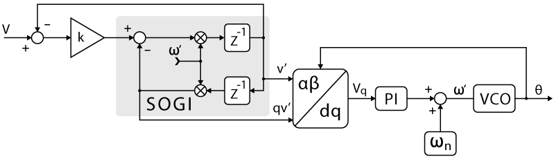

# SOGI

SOGI is a second order generalized integrator. It is used to extract the positive and negative sequence components of a three phase signal. It is widely used in power electronics for control purposes. 

## Theory

Second-order Generalized Integrators (SOGI) have recently been proposed for use as phase detectors [2], namely within PLL structures in grid-tie power inverters.

Numerous grid synchronization techniques exist, featuring various performances, objectives, and complexity. An extensive review of possible implementations is proposed in [1]. Among them, many rely on a phase detector that offers some immunity to voltage waveform distortions (harmonics and/or unbalances). This immunity, related to the employed filtering techniques, is often a difficult trade-off with other expectations in terms of dynamic performance (phase and/or amplitude tracking).

SOGI structures are essentially notch filters (band-pass) that can be easily tuned to the grid frequency. In addition, these have the attractive benefit of providing simultaneous access to both the filtered output as well as a quadrature-shifted version of the same output (α and β axes). As such, they allow for an easy implementation that can fit that of conventional dq-type PLLs (using the Park transform as phase detector).

The general principle of the SOGI-based PLL is given below:

